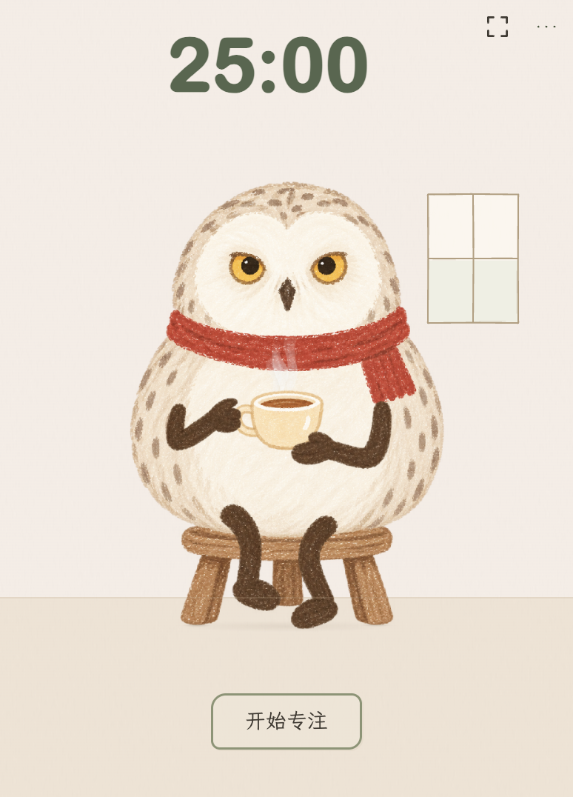

# iRIXI 猫头鹰番茄钟

写下这次想做的一件事，选好时间，和红围巾猫头鹰一起开始。它会喝茶、眨眼、安静地陪着你；专注时动作放轻，暂停时停下来。



*当前已安装工具箱的大尺寸组件界面示例，拍摄时使用新建隔离存档。独立源码复用同一角色和界面；这张图展示原版空闲房间，不代表修复后独立窗口的桌面验收。*

## 现在可以做什么

- 设置任务和专注时长，开始、暂停、继续或提前结束；完成后手动开始休息或下一轮。
- 有效专注每满一分钟得到一枚成长印记。当前累计5分钟解锁圆眼镜，10分钟解锁阅读椅；红围巾一直保留，眼镜和座位可以在设置里切换。
- 在本机保存成长、装扮和未完成的一轮。重开或检测到中断后先暂停，等你确认再继续；暂停、休息和离线时间不计入成长。
- 打开一个小窗口，两种视图共用同一次计时。可开启“减少动效”。

这份独立源码来自现有工具箱的猫头鹰模块，包含空任务提示压住“开始专注”文字的隔离布局修复。当前发布的是可独立运行的源码候选，真实内嵌桌面回归尚未完成，已安装工具箱尚未更新此修复。

**APP 时间记录暂未接入独立版的系统查询，入口保持关闭。** 原模块已有本地记录、汇总和手动分类代码，真实采集未完成验收。本项目保留合成数据演示用于检查逻辑，不会把演示当作你的实际活动。角色点击回应、鼠标注视和新的背景质感还未实现。

## 运行

准备 Node.js 22.12 或更高版本。下载项目，或用 Git 获取源码：

```sh
git clone https://github.com/Irixil/irixi-owl-focus.git
cd irixi-owl-focus
```

在项目目录执行：

```sh
npm ci
npm start
```

Electron 固定为44.0.0，首次启动时会按需下载对应平台的运行时。本轮在 macOS arm64 检查；其他平台的桌面效果待验证。当前提供源码启动方式，尚未提供签名安装包。

开始前先写任务；右上角“…”里可以改时长、切换装扮和查看记录说明。“打开小窗口”会打开同一次计时的另一种视图。

独立版使用自己的存档目录，和已安装工具箱分开：macOS 位于 `~/Library/Application Support/IRiXi Owl Focus`。移动源码目录不会移动这个存档。开发检查可用 `OWL_FOCUS_DATA_DIR` 指定另一个目录，避免写入日常数据。遇到损坏存档会停止并提示，原文件保留。

## 开发检查

```sh
npm test
npm run verify:ui
npm run verify:reopen
```

前两条分别检查计时/保存/恢复逻辑和独立入口；最后一条接着上一条，用新进程检查暂停恢复。界面检查每次另建本地测试存档，采用离屏 Electron，不需要操作桌面，也不等于用户桌面验收。检查结果保存在 `.runtime`，不纳入仓库。

如需查看 APP 汇总和分类的合成演示：

```sh
npm run demo:synthetic
```

打开终端输出的本机地址。所有 APP 都是固定的“合成示例”，只在回环地址运行；按 `Ctrl+C` 结束。普通 `npm start` 不启动这个演示服务器。

## 素材与许可

角色、动画部件和装备沿用项目已经确认的生成素材；手写字体为霞鹜文楷，保留原 SIL OFL 1.1 许可。详情见 [素材清单](docs/assets.md)。

项目当前未选择开放源码许可，标记为 `UNLICENSED`；公开仓库不代表额外授予源码或美术素材许可。第三方字体和依赖按各自许可证使用。
