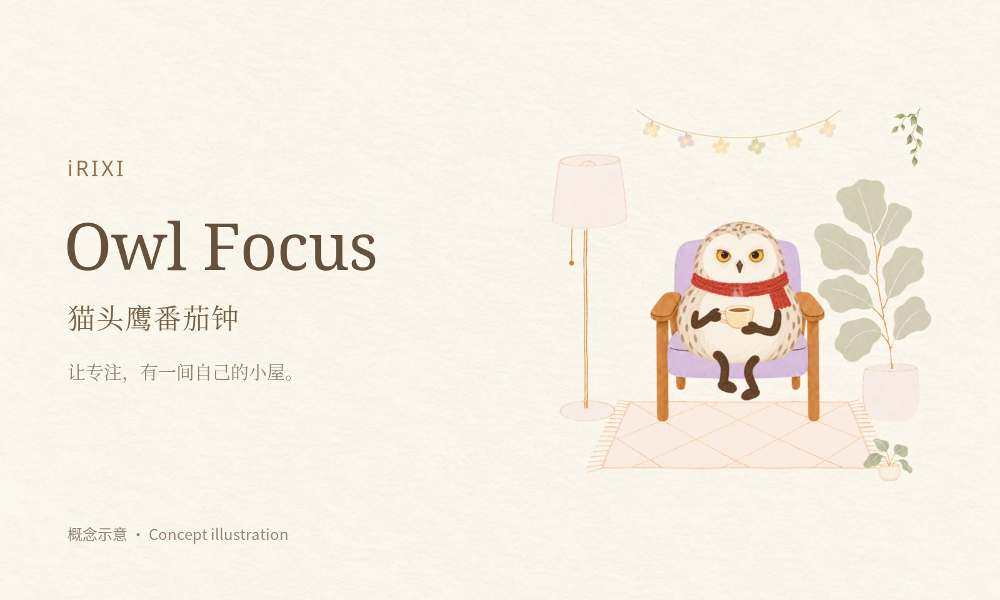
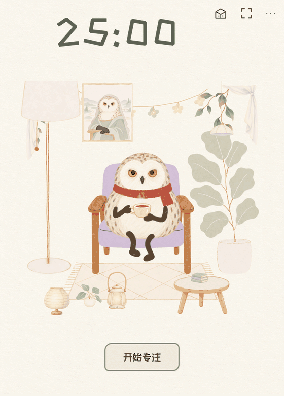

# iRIXI 猫头鹰番茄钟

项目创作者：**[IRiXi](https://github.com/Irixil)**（GitHub：Irixil）。原始仓库：[Irixil/irixi-owl-focus](https://github.com/Irixil/irixi-owl-focus) · [作者与推荐署名](ATTRIBUTION.md)。

让专注有一间自己的小屋。写下这次想做的一件事，和捧着茶杯的红围巾猫头鹰一起开始；再用喜欢的灯、地毯、植物和挂画布置房间。



*产品概念示意，由本项目艺术素材合成。不是应用截图。*



*这是早期版本的实机演示，未展示本次竖版适配、纸纹、镜像／卸下和500%输入。使用本项目隔离测试数据，并开启“全道具体验”；不包含私人任务或真实专注记录，不代表已通过真实专注解锁这些道具。*

## 可以做什么

- **专注与陪伴**：设置任务和时长，开始、暂停、继续或结束；猫头鹰会眨眼、喝茶，点一下也会回应。支持减少动效。
- **收藏与换装**：在图形道具箱跨分类试摆。全道具体验与正常装扮、永久收藏分开保存，试用不会增加专注时间或奖励。
- **自由布置**：拖动或用四方向按钮移动灯、地毯、植物、挂画、桌子及新装饰；可跨过原画布边界或移出屏幕；从收藏箱重选后点“找回”即可回到房间。重叠会提示，可以继续调整或保存。
- **大小和前后**：选中道具可输入50%–500%或用加减按钮等比例缩放，点“原大”恢复原大小；“前／后”调整遮挡。桌子与所属摆件保持附着，椅子和猫头鹰保持完整坐姿及原比例。
- **镜像与卸下**：适用道具可主动左右翻转，点“卸下”移出房间；道具仍保留在收藏箱，重新装备会记得原来的位置、大小和方向。卸下收藏椅会回到初始凳子。
- **放好才保存**：位置、大小、层次和选择整组保存；取消恢复原搭配，恢复默认先进入试摆。正常／测试布置独立，重开保留已保存内容。
- **柔和纸感**：保留此前番茄钟配色，细微纸纹只作用于内部背景和收藏面板；原角色和物件不加滤镜、不改色。
- **同一房间适配不同尺寸**：背景、物件、点击和拖动共用比例映射，以最大竖版的完整房间为基础缩小；打开收藏侧栏后仍能看到房间，小尺寸保留可操作的布置按钮。

新增装饰包括手提灯、左右藤蔓、左右帘饰和花串灯。左右预设可分别摆放，也能主动翻转选中的道具。部分新增道具目前通过全道具体验使用，未新增永久解锁门槛。

有效专注每满一分钟得到成长印记；既有累计5分钟解锁圆眼镜、10分钟解锁阅读椅。暂停、休息和离线时间不计入成长。重开或检测到中断后，未完成的一轮先暂停，等你确认继续。

## 从源码运行

需要 Node.js 22.12 或更高版本：

```sh
git clone https://github.com/Irixil/irixi-owl-focus.git
cd irixi-owl-focus
npm ci
npm start
```

想直接试用已有道具：

```sh
npm start -- --test-all-items
```

这个启动参数只在尚未选择过测试开关时默认开启，之后尊重保存的开关。也可在应用的“更多 → 收藏与装扮”中切换。

Electron 固定为44.0.0。当前提供源码启动方式，尚未发布通用签名安装包。本轮布置功能在 macOS arm64 工具箱内嵌模块进行了实际鼠标检查；独立入口的开始／暂停、双视图同步和新进程恢复另用隔离数据检查。其他平台尚未验收，原工具箱的其他模块不随此仓库分发。

## 本地数据与当前边界

数据保存在本机；独立版与工具箱使用不同存档。开发或测试可通过 `OWL_FOCUS_DATA_DIR` 指向另一个目录。旧存档升级前保留原字节备份；损坏存档会停止并提示，不能用空进度覆盖。

独立版尚未接入真实前台 APP 查询，记录入口保持关闭。没有手机端、App Store 上架或长期记忆功能。本轮没有重新验证整机真实睡眠与长期后台运行；计时也不是实际工作完成的证明。

本轮在工具箱内嵌模块完成实际桌面输入的四尺寸拖动、大小／镜像／图层、取消、整组保存及新进程恢复，隔离测试布局恢复，正常装扮、权益与专注时间保留。独立入口的开始／暂停、双视图和新进程恢复另用隔离隐藏窗口检查；修正后的完整房间检查还覆盖角色注视／轻拍、长按／取消、键盘回应、减少动效、原座位接点与四尺寸空任务提示。隐藏截图偶有合成层未刷新，不能把这些截图算作完整视觉验收；实际前台房间另行查看。新版竖版和纸感参考图实际像素尚未取得，不能声称已经对照；内部纸感依据文字要求调整。没有上传本轮诊断截图或参考图；详见[竖版适配与验证边界](docs/room-camera-v56.md)。

## 开发检查

```sh
npm test
npm run verify:ui
npm run verify:reopen
npm run verify:room
npm run verify:durations
npm run verify:durations-reopen
```

逻辑检查、离屏独立入口检查和实际桌面操作证据有不同范围，见[验证说明](docs/verification.md)。

## 素材与许可

角色和房间使用本项目生成并确认的艺术素材，概念主图沿用这些素材排版合成。界面字体为站酷快乐体，罕见字回退霞鹜文楷；随仓库保留各自 SIL OFL 1.1 许可。概念图的栅格文字字体及来源说明见[概念图来源](docs/images/concept-sources.txt)，项目素材见[素材与来源](docs/assets.md)。

本项目自身源码和美术仍为 **UNLICENSED**；公开仓库不代表额外授予开放源码或艺术素材授权。第三方字体和依赖分别按其许可证使用。


## 59外观修正与下一轮操作说明

当前使用方法：在“更多 → 下一轮设置”中调整下一轮专注和休息时长，离开输入框或点“保存下一轮时长”即可保存。未开始、运行中或暂停时都可保存；设置只影响之后的轮次，本轮原时长和已计进度保持，不需要先结束本轮，也不会清空历史。若要立即换一轮，填写或沿用任务后点“开始下一轮”，上一轮提前结束并仅保留实际专注时间，新轮立即从设置时长开始；未完成的部分不算完成或补发成长。

本次修正纸纹被不透明房间画布盖住的问题：纹理现在绘于背景和原角色、道具之间，四种正常尺寸可见；外层工具箱仍平整奶油米色。已在隔离包中验证时长保存、双视图同步、实际倒计时和新进程恢复。本次59已在同一正式工具箱完成备份替换和正常重开核对，真实记录、暂停轮次、布局及权益保留。刘海在本机真实2倍屏幕上核验为左右及底部各内收3个实际像素，四种内嵌尺寸的纸纹已实际查看；纸感参考原像素仍未取得。

本次实际使用Ponytail（默认full）及Ponytail audit审查实现和冗余引用；约2.29GB旧构建、缓存及失效装饰纹理仅移入本机可恢复目录，未永久删除，未释放这部分磁盘空间。真实资料、必要回退和第三方许可证保留；清理后的候选包已重新构建并复测。

## 61随时开始下一轮修正（正式版已更新）

用户说明：上一轮没专注完，也必须能直接开始下一轮。已修正正式59因历史暂停轮次锁住设置的问题；此前空闲37/7检查和锁定说明未解决这个问题。61同时支持随时保存下一轮默认值，以及运行、暂停、休息中直接“开始下一轮”。保存默认值保持本轮不动；开始下一轮由同一计时核心一次结束旧轮并启动新轮，仅保留真实有效专注，不增加离线或未完成时间。参数错误、旧窗口命令及写入失败不会先丢掉旧轮。

签名后的确切应用包和独立入口已完成隔离实际输入、保存、直接换轮、双视图同步、四种尺寸、倒计时及新进程恢复检查；使用正式版那条暂停90分钟记录的副本复现，真实资料没有用于测试写入。正式工具箱61已用原签名身份备份替换并正常重开，真实暂停轮次、累计时间、收藏、装扮、布局及原时长设置核对保留，仍是schema9，没有补计离线时间。实际正式窗口中已查看“开始下一轮”和专注90/休息5时长输入；没有替用户开始新轮或修改真实默认值。启动时先出现初始占位内容，加载完成后恢复原房间和实际剩余时间。

全部截图只保存在本机，没有上传。原有纸纹、美术、刘海、导航和房间布局代码保留；新包六个计时/设置相关文件改动，其余226个文件、113张原PNG及原生代码字节保持。四尺寸输入和换轮检查属于隔离实际窗口证据；本次正式版只做必要重开与入口核对，没有重演全部前台导航/拖动/其他屏幕验收，也不代表完整项目所有历史验收通过。
